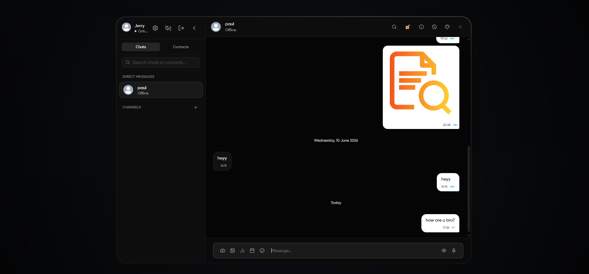
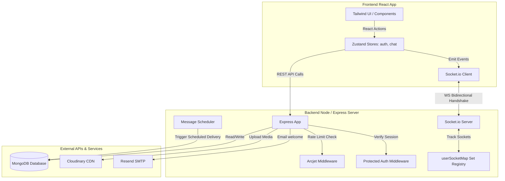
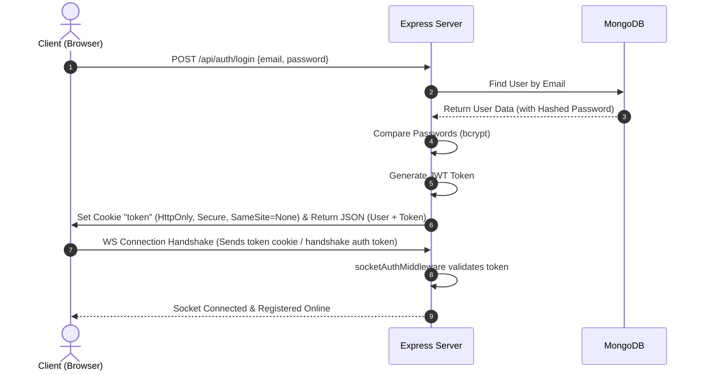

# 💬 Emitly — Premium Real-Time Chat Application



A state-of-the-art, secure, and feature-rich real-time messaging application built using the MERN stack. Emitly combines modern web design aesthetics with robust engineering practices, providing an experience comparable to industry-leading chat applications like Discord and Slack.

---

## 🚀 Key Features

*   **🔐 Cross-Domain Authentication**: Secure custom JWT authentication using HttpOnly, Secure, and SameSite=None cookies, complemented by token fallbacks for cross-domain and mobile views.
*   **⚡ Real-Time WebSocket Messaging**: Low-latency bidirectional communication powered by Socket.io.
*   **👥 Robust Presence Tracking**: Set-based socket connection registry on the backend, allowing users to safely connect from multiple tabs/devices without causing offline state race conditions on reload.
*   **🔒 Secret E2E Encrypted Chats**: Zero-trace private chats utilizing local RAM-only Elliptic-Curve Diffie-Hellman (ECDH) key exchanges and local encryption/decryption. Messages are wiped completely on session close.
*   **📈 Message Delivery Receipts**: Complete message state lifecycle tracked via visual ticks (Sent ✔️, Delivered ✔️✔️, Seen/Blue ✔️✔️).
*   **🎨 Premium Breathing Animations**: Synchronized, elegant breathing online indicators (`animate-pulse-breath`) that dim and brighten naturally without generating distracting radiating ring animations.
*   **🎙️ Media & File Sharing**: Base64 image uploads hosted via Cloudinary, coupled with custom audio recordings and built-in interactive audio players.
*   **📅 Message Scheduling**: Queue messages to be dispatched at a precise time in the future.
*   **🚦 Arcjet Route Protection**: Express routes fortified with Arcjet middleware shield endpoints against brute force attacks and rate limits.
*   **📨 Transactional Emails**: Automated welcoming emails triggered upon successful account creation using the Resend API.
*   **🎨 Curated Dark Aesthetics**: Sleek dark-mode layout built with React, Tailwind CSS, and DaisyUI featuring glassmorphism, responsive drawers, and mouse spotlight shadows.

---

## 🏗️ Architecture

Emitly relies on an event-driven client-server architecture utilizing persistent bidirectional WebSocket links alongside standard REST APIs.



---

## 🔄 App Flow

### 1. Verification & Presence Setup
1.  **Auth Check**: On application load, the frontend hits `/api/auth/check`. If a valid JWT cookie is found, the user profile is returned.
2.  **Socket Handshake**: The client immediately connects to the Socket.io server. The server verifies the token inside the handshake cookie or `auth.token` payload using `socketAuthMiddleware`.
3.  **Active Registry**: Once authenticated, the socket ID is added to a `Set` corresponding to that user ID inside the global `userSocketMap`. The server then broadcasts the list of all online user IDs to all active clients.

### 2. Message Lifecycle (Standard & Real-Time Seen Loops)
1.  **Optimistic Rendering**: When a user clicks send, the frontend immediately generates a temporary ID (`temp-*`) and renders the message in the UI with a pending status.
2.  **API Delivery**: The frontend sends the payload to `/api/messages/send/:id`. The server saves the message to MongoDB.
3.  **Socket Broadcast**:
    *   If the recipient is online, the server pushes the message to the recipient's socket via `"newMessage"` and notifies the sender via `"messageDelivered"` to change the tick status to a double-tick.
    *   If the recipient is actively looking at the sender's chat window, the recipient's browser immediately emits `"messageSeen"` back to the server, which updates the database status and fires `"messageSeenUpdate"` to the sender, turning the ticks blue.

---

## 🔐 Authentication Flow

Emitly implements a robust cookie-based authentication flow with local fallback capabilities:



---

## 📂 Project Folder Structure

```bash
Emitly/
│
├── backend/                         # Node/Express Backend
│   ├── src/
│   │   ├── controllers/             # Endpoint route controllers (Auth, Messages, Groups, Secrets)
│   │   ├── emails/                  # Email templates & sending logic
│   │   ├── lib/                     # Database client, Cloudinary, Scheduler, Socket config
│   │   ├── middleware/              # Auth guard, Arcjet rate-limiting, Socket Auth middleware
│   │   ├── models/                  # Mongoose MongoDB schemas (User, Message, Group, SecretChat)
│   │   ├── routes/                  # Express endpoints router groupings
│   │   └── server.js                # Server entry point, Port bindings & Express configuration
│   └── package.json
│
└── frontend/                        # React Frontend
    ├── public/                      # Static UI asset files (sounds, defaults)
    ├── src/
    │   ├── components/              # Modular UI elements (ChatContainer, ChatHeader, ChatsList, etc.)
    │   ├── hooks/                   # React custom hooks (keyboard sounds, inputs)
    │   ├── lib/                     # Axios instance base config, E2E cryptographic functions
    │   ├── pages/                   # Application page views (ChatPage, LoginPage, SignUpPage)
    │   ├── store/                   # Zustand store files (useAuthStore, useChatStore)
    │   ├── index.css                # CSS entry point, Custom themes & animations
    │   ├── App.jsx                  # Application routing & viewport setup
    │   └── main.jsx                 # Client entry point
    └── package.json
```

---

## 🛠️ Tech Stack & Why It Was Chosen

### 1. Frontend
*   **React (Vite)**: Selected for its fast virtual DOM rendering, modular architecture, and excellent ecosystem support. Vite provides instantaneous hot-reloads and optimal build times.
*   **Zustand**: An extremely lightweight state manager that eliminates the excessive boilerplate code of Redux. It allows components to subscribe shallowly to state updates, preventing unnecessary UI re-renders, and hooks directly into socket listeners outside of the React render loop.
*   **Tailwind CSS & DaisyUI**: Provides utility-first styling for maximum interface customizability, fluid animations, and a polished, professional look without custom CSS bloat.

### 2. Backend
*   **Node.js & Express**: Provides an asynchronous, event-driven single-threaded execution loop that scales efficiently when handling thousands of concurrent open WebSocket streams.
*   **Socket.io**: Wraps the standard WebSocket protocol with robust features such as auto-reconnection fallbacks, HTTP long-polling upgrades, and socket rooms out of the box.
*   **MongoDB & Mongoose**: Flexible document-based schema that maps cleanly to JSON objects sent between the clients and server, making message storing and querying straightforward.

### 3. Core Integrations
*   **Arcjet**: Secures endpoints natively from inside application code, shielding login/signup pages from bots, scraper tools, and DDoS attacks.
*   **Cloudinary**: Handles heavy base64 media transformations, compression, and delivery over a global CDN.
*   **Resend**: Deliver welcoming emails to newly registered accounts using clean React Email templates.

---

## ⚙️ Environment Variables

To run Emitly locally or in production, you must configure the following environment variables:

### Backend Configuration (`backend/.env`)

```env
PORT=3000
MONGODB_URI=your_mongodb_connection_string
JWT_SECRET=your_jwt_signing_secret
NODE_ENV=development # or production

# Cloudinary Credentials
CLOUDINARY_CLOUD_NAME=your_cloudinary_cloud_name
CLOUDINARY_API_KEY=your_cloudinary_api_key
CLOUDINARY_API_SECRET=your_cloudinary_api_secret

# Resend API Credentials
RESEND_API_KEY=your_resend_api_key

# Arcjet Protection Credentials
ARCJET_KEY=your_arcjet_key

# Client URL (for CORS validation)
CLIENT_URL=http://localhost:5173
```

### Frontend Configuration (`frontend/.env`)

```env
VITE_API_URL=http://localhost:3000/api
VITE_BASE_URL=http://localhost:3000
```

---

## 🧑‍💻 Author

**Prateek Rawat**
*   🔗 **GitHub**: [Prateekrwt2005](https://github.com/Prateekrwt2005)
*   🔗 **Project URL**: [Emitly App](https://emitly-chatapp.vercel.app)
